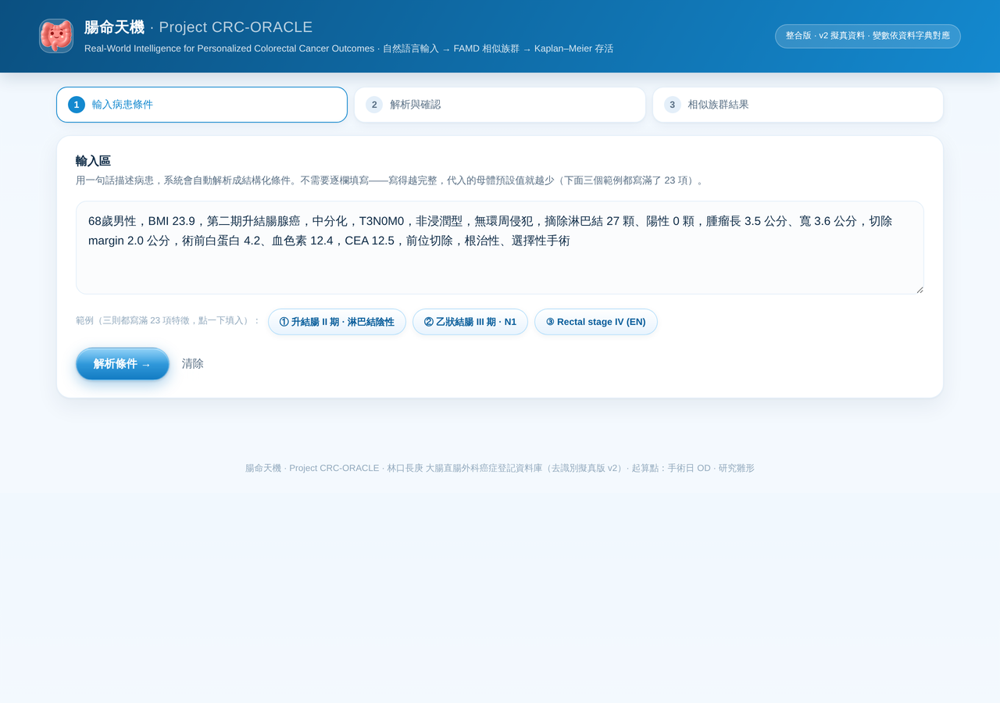
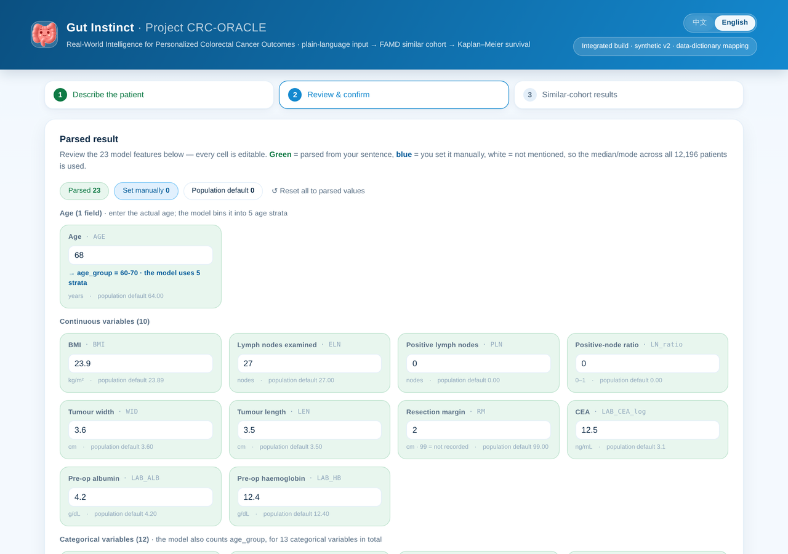
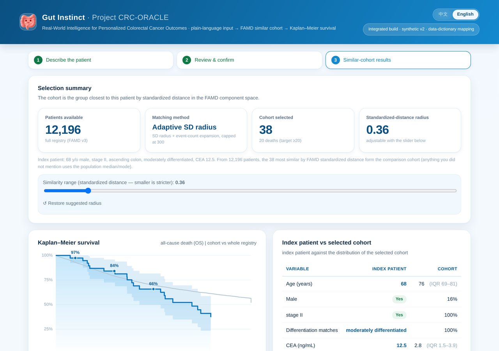
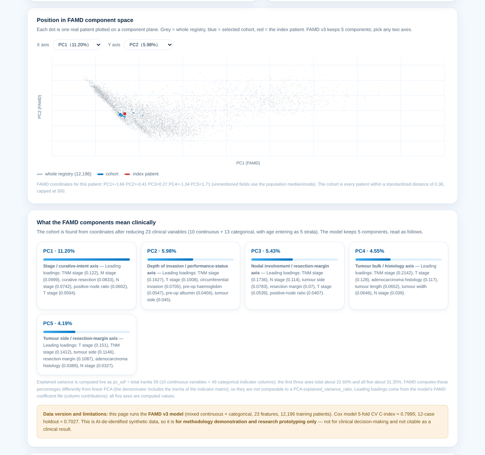

# 腸命天機 · Project CRC-ORACLE

> **Real-World Intelligence for Personalized Colorectal Cancer Outcomes**
> Describe a colorectal cancer patient in one plain sentence — the system finds the most similar patients in a 12,196-case registry and returns their survival curve and post-operative outcomes.

**Live demo → https://crc-oracle.vercel.app**

A StanCode SC201 project. A surgeon types a free-text clinical description; the system maps it to the registry's official codebook variables, projects the patient into a **FAMD** (Factor Analysis of Mixed Data) space, selects a similar-patient cohort by standardized distance, and reports **Kaplan–Meier** survival with Greenwood 95% CI alongside surgical mortality and length of stay.

---

## Screenshots

| 1 · Describe the patient | 2 · Review the parsed variables | 3 · Similar-cohort outcomes |
|---|---|---|
|  |  |  |

### The FAMD component space

Every dot is one real patient. Grey is the whole registry, blue the selected cohort, red the index patient — so you can see at a glance whether the cohort actually sits close. Any two of the five components can be plotted, and each axis carries its leading loadings.



### Bilingual interface

The whole interface switches between English and Traditional Chinese from the header — variable names, units, category levels, component interpretations and the worked examples all follow. The choice is remembered; without one, it follows the browser locale.


---

## How it works

**1 · Natural-language input (Chinese or English).** One sentence, e.g.
`68歲男性，第二期升結腸腺癌，中分化，CEA 12.5` or
`68-year-old male, stage II ascending colon adenocarcinoma, moderately differentiated, CEA 12.5`

**2 · Parse and confirm.** All 23 model features are shown as editable cells — age as one field (binned into 5 strata by the model), then 10 continuous and 12 categorical — each labeled with its variable name and colour-coded by provenance:

| | Meaning |
|---|---|
| 🟩 green | parsed from your sentence |
| 🟦 blue | you overrode it manually |
| ⬜ white | not mentioned — population median (continuous) or mode (categorical) is substituted |

Nothing is silently assumed. If the sentence didn't mention albumin, the card says so and shows the population value being used instead.

**3 · Similar cohort and outcomes.**
- Kaplan–Meier curve with Greenwood 95% CI, cohort vs. whole registry
- 1 / 3 / 5-year overall survival
- In-hospital mortality (`MT`) and median post-operative length of stay with IQR
- Index patient vs. cohort comparison across all 23 variables
- FAMD component positions (PC1–PC5) with a clinical reading of each axis
- Adjustable similarity radius — the cohort updates live

---

## The model

**FAMD** handles continuous and categorical clinical variables in one decomposition, instead of forcing ordinal codes onto categories the way linear PCA would. Continuous variables are z-scored; each one-hot indicator is encoded as `(indicator − p) / √p`; both pass through an outer `StandardScaler` before SVD.

**23 features — 10 continuous + 13 categorical:**

| Continuous | Categorical |
|---|---|
| BMI, ELN (nodes examined), PLN (positive nodes), LN_ratio, WID, LEN, RM (resection margin), LAB_CEA_log, LAB_ALB, LAB_HB | SEX, **age_group**, TNM_stage, T_stage, N_stage, M_stage, site_group, HT_adenoca, HG_grade, GA_infiltrative, CI, IR_curative, OT_emergency |

**Age is binned, not continuous.** Survival risk is not linear in age — 50–60 and 60–70 carry the *lowest* risk, under-50 sits in the middle (early-onset CRC is intrinsically more aggressive), and 80+ is highest. Recoding age into `<50 / 50-60 / 60-70 / 70-80 / 80+` improved 5-fold CV C-index from 0.7978 to **0.7995**.

**Explained variance** (denominator is the total inertia of the mixed indicator matrix, 59 — these percentages are *not* comparable to a linear PCA's `explained_variance_ratio_`):

| | PC1 | PC2 | PC3 | PC4 | PC5 |
|---|---|---|---|---|---|
| % of inertia | 11.20 | 5.98 | 5.43 | 4.55 | 4.19 |
| cumulative | 11.20 | 17.17 | 22.60 | 27.16 | **31.35** |

**Cox proportional-hazards C-index** (model quality, not used for the cohort search):

| | this model | previous (age continuous) |
|---|---|---|
| training | 0.8011 | 0.7993 |
| **5-fold CV** | **0.7995** | 0.7978 |
| 12-case holdout | 0.7027 | 0.7568 |

> The holdout column moves a lot because it is only 12 patients — one or two rank swaps shift it by several points. The 5-fold CV figure is the one to read.

**Cohort selection.** The radius grows from the index patient in standardized-distance space until cumulative death events reach 20, clamped to 30–300 patients. If a manually-set radius contains nobody, the page says so and reports the distance to the nearest patient — it does not quietly substitute the nearest N.

---

## Cohort size

```
12,250  rows in the de-identified registry export
  − 42  follow-up ≤ 0 days (same-day admission/discharge, no real follow-up)
  − 12  held out for validation
────────
12,196  patients available for matching
```

---

## Running it

The site is a **single self-contained HTML file**. The full patient matrix and the FAMD encoder are embedded in it, so there is no backend, no build step and no network dependency:

```bash
open index.html          # that's it
```

Deployment is a static push — see [DEPLOY.md](DEPLOY.md).

---

## Team

| | |
|---|---|
| **陳繹中** (lead) | Colorectal surgeon, Linkou Chang Gung Memorial Hospital — clinical validation, data access, UI direction |
| **陳奕閔 Steven Chen** | UI/UX and front-end integration |
| **鄭文森 Kevin, Sean** | FAMD dimensionality reduction and survival analysis |

---

## ⚠️ Data and limitations

This runs on **v2 AI-de-identified synthetic data**. Stage stratification behaves sensibly (stage I ~89% 5-year OS, stage IV ~23%), but de-identification distorts inter-variable clinical relationships.

**For methodology demonstration and research prototyping only. Not for clinical decision-making, and not citable as a clinical result.** The page states this limitation to the user directly.

Because the whole dataset is embedded in `index.html`, **anything deployed publicly can be downloaded in full**. That is acceptable for synthetic data. Never deploy a build containing real patient records the same way.
